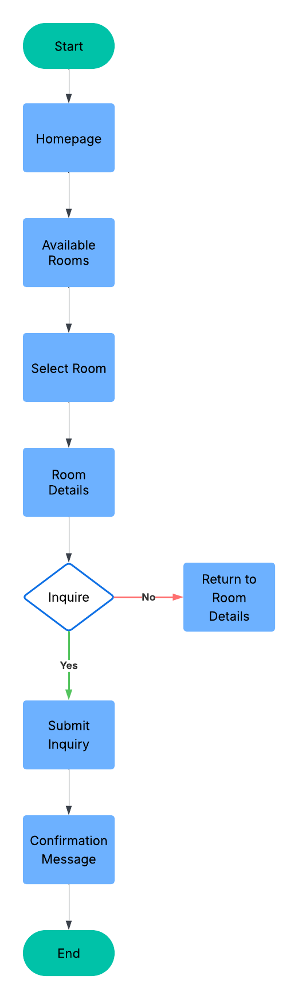

# Rental Property Booking Flow Chart
---
## Basic Flow Chart: Business Inquiry Process

This flow chart visually represents the step-by-step process a user follows to inquire about a hotel room, from landing on the homepage to receiving a confirmation message.

---
### Purpose
Show the step-by-step process a user goes through when making a room inquiry.

### Example Use
Home page → Browse rooms → View room details → Contact form → Submit inquiry → Confirmation message

---

### Visual Flow Chart

---

### Steps in the Process

1. **Home Page**: User lands on the main website and can navigate to browse available rooms.
2. **Browse Rooms**: User views a list of available rooms, possibly filtering by preferences.
3. **View Room Details**: User selects a room to see more detailed information.
4. **Contact Form**: User fills out an inquiry form for the selected room.
5. **Submit Inquiry**: User submits the inquiry form.
6. **Confirmation Message**: User receives a confirmation that their inquiry was submitted successfully.

---

### Explain basic flow chart

This basic flow chart illustrates the website's primary user journey for inquiring about a business room rental. It begins with the user landing on the homepage, browsing available rooms, viewing details of a selected room, filling out an inquiry form, and finally submitting that form to receive a confirmation message. 

I chose the Basic Flow Chart format for this process because it provides a high-level, easy-to-follow visualization of the room inquiry process without technical details. I faced the challenge of using luicd since it was my first time using it. 

