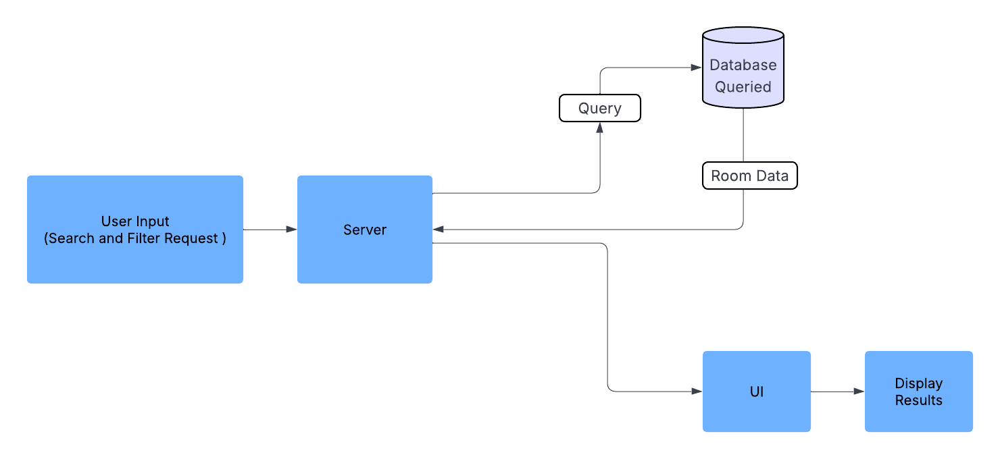

# Room Data Flow Chart

## Purpose
This document illustrates how room data moves through the system, from user input to final display.
## 
## Data Flow
Example Use : User inputs search/filter → Request sent to server → DB queried for available rooms → Results sent back → Rendered on UI

