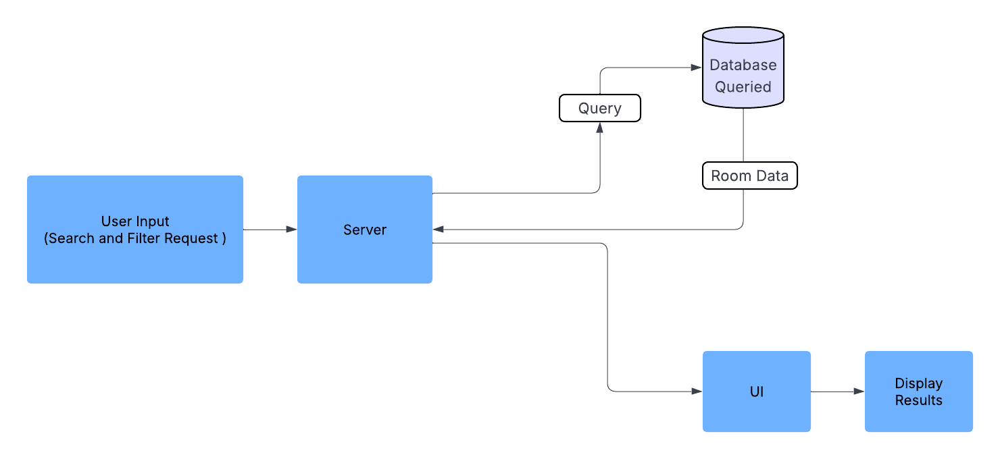

# Room Data Flow Chart

--- 
## Purpose
This document illustrates how room data moves through the system, from user input to final display.

## Data Flow
Example Use : User inputs search/filter → Request sent to server → DB queried for available rooms → Results sent back → Rendered on UI

---

### Explanation: Room Data Flow Chart

This Data Flow Chart illustrates how room-related data travels through the Business Rental booking system when a user performs a search or filter action. The process begins when a user selects filters (e.g. room type, floor) on the frontend. That input is sent to the backend server via an API request. The server then queries the database for matching room entries, and the results are sent back and dynamically rendered on the user interface.

The Data Flow Chart format was chosen because it focuses specifically on how data is transferred, stored, and retrieved within the system. This view is particularly useful for identifying performance bottlenecks, potential points of failure, or privacy/security concerns. A key insight from mapping this flow is the importance of efficient querying and data validation slow database responses or incorrect data can significantly impact the user experience. Ensuring smooth interaction between frontend filters and backend logic is crucial for delivering fast, accurate results to potential renters.

---

