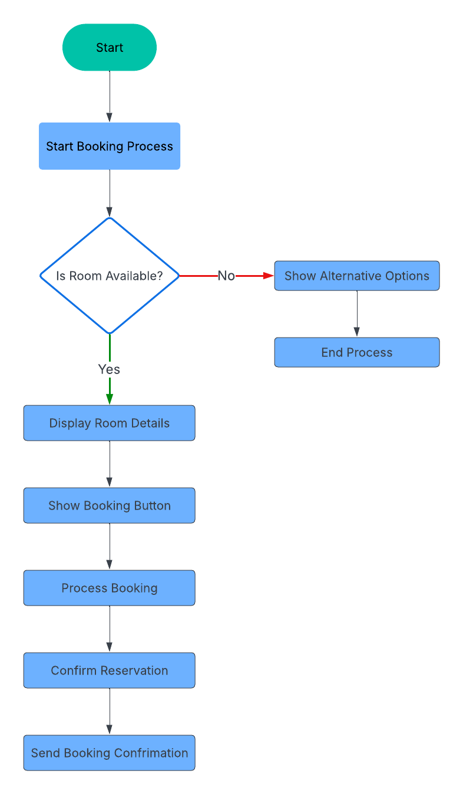

# Decision Flow Chart: Room Booking Process
---
## Purpose: 
---
Highlight decisions

## Example Use : 
---
“Is room available?” → If yes, show details + booking button.

---

### Explanation: Decision Flow Chart – Room Booking Process

This Decision Flow Chart focuses on the conditional logic involved in the room booking process. It centers around a critical decision point: whether a room is available. If the room is available, the system proceeds to display detailed information along with a booking or inquiry option. If the room is not available, the user may be shown an alternative room, or simply a “not available” message.

This format was chosen because decision flow charts excel at visualizing branching logic based on conditions. It's particularly useful when a process outcome depends on user actions or system states. A key insight is the importance of real-time availability data to ensure that users don’t attempt to book already-occupied rooms, which could create frustration or credibility issues.

---

