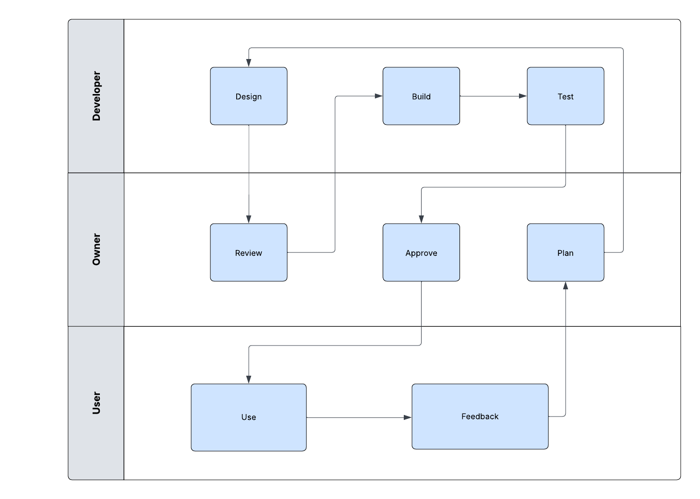

# Swimlane Flow Chart

## Purpose
Show simple task distribution across different roles in a process.

## Example Process: Basic Task Management

## Key Responsibilities

### Developer
- Design solutions
- Build features
- Test functionality

### Owner
- Plan requirements
- Review work
- Approve changes

### User
- Use the product
- Give feedback

## Simple Process
1. Owner plans requirements
2. Developer designs solution
3. Owner reviews design
4. Developer builds and tests
5. Owner approves
6. User uses the product
7. User provides feedback
8. Process repeats 