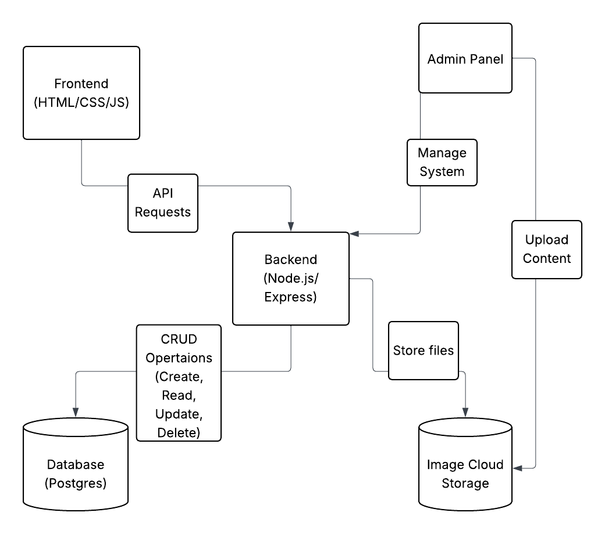

# System Flow Chart: Architecture & Tech Interactions

### Purpose: 
Show how the tech stack components interact.

### Example Elements:
Frontend (HTML/CSS/JS) → API calls → Backend (Node.js/Express) → Database (PostgreSQL) → Image hosting → admin panel interaction

### Explain System flow chart

This System Flow Chart represents the technical architecture of the Business Rental website. It visualizes how key components of the system interact with each other—starting from the frontend (HTML/CSS/JS) where users browse the site, to the backend (Node.js/Express) that handles logic and routing, and ultimately to the database (PostgreSQL) where room availability and inquiry data are stored. It also includes an admin panel that allows the property owner to manage room listings and content.

This flow chart format was chosen because it clearly illustrates the system-level structure and data flow—essential for understanding how the parts of the application are connected and dependent on one another. One key insight that emerged from mapping this out was the need for scalable and reliable database interactions to handle real-time room availability.