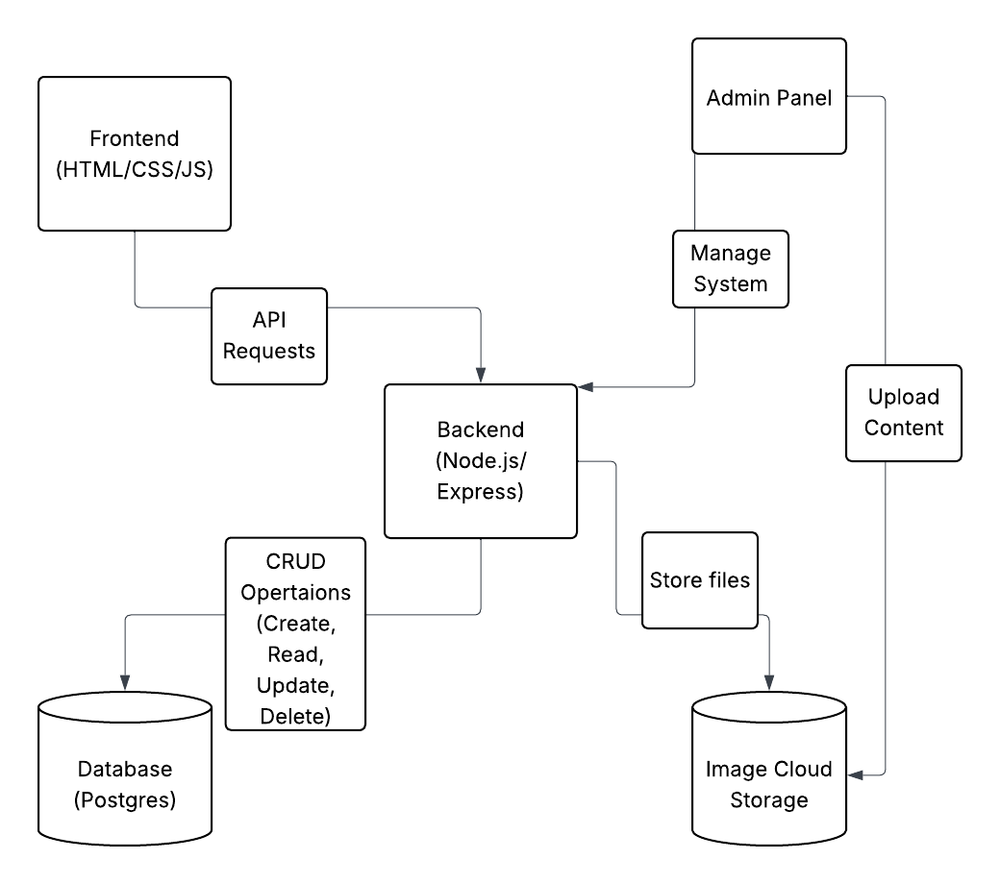

# System Flow Chart: Architecture & Tech Interactions

### Purpose: 
Show how the tech stack components interact.

### Example Elements:
Frontend (HTML/CSS/JS) → API calls → Backend (Node.js/Express) → Database (PostgreSQL or Firebase) → Image hosting → admin panel interaction

