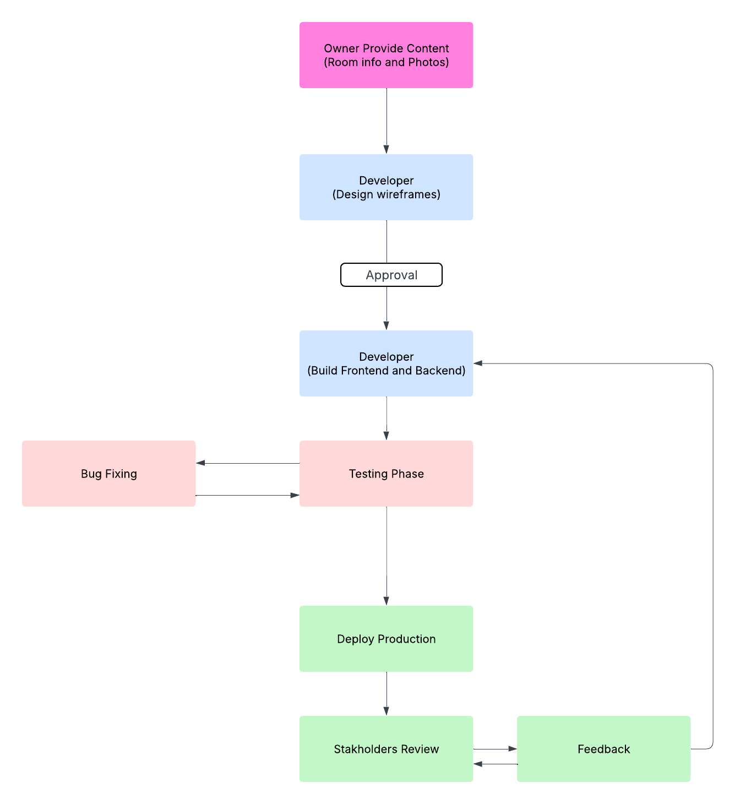

# Workflow Diagram: Hotel Booking Platform Development

### Purpose: 
Show the project development workflow from initial content to final deployment and review.

### Example Steps:

Owner provides room info/photos → Developer designs wireframes → Developer builds frontend → Test → Deploy → Owner reviews/requests edits

