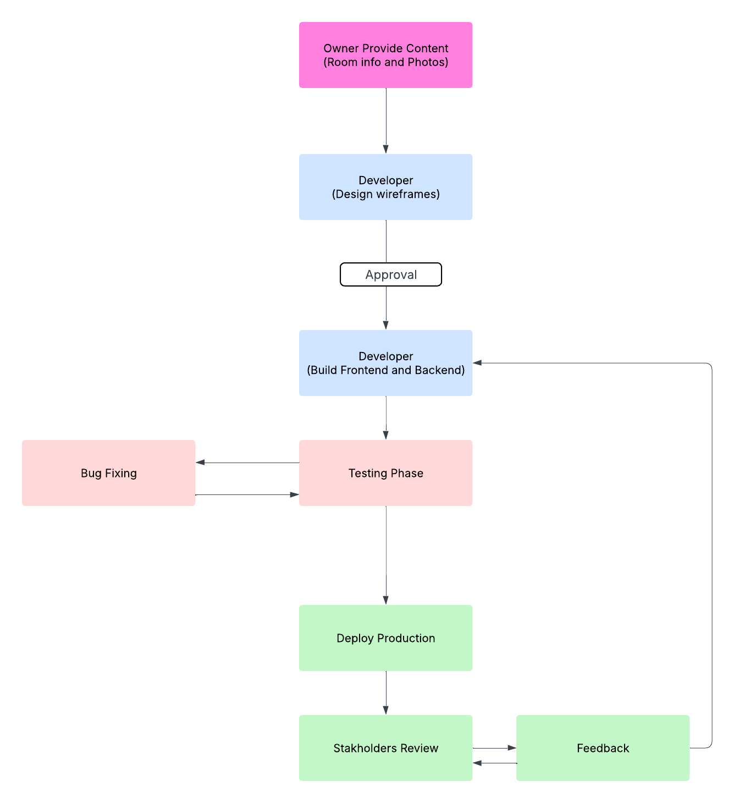

# Workflow Diagram: Property Rental Platform Development

### Purpose: 
Show the project development workflow from initial content to final deployment and review.

### Example Steps:

Owner provides room info/photos → Developer designs wireframes → Developer builds frontend → Test → Deploy → Owner reviews/requests edits

### Explain workflow chart

This Workflow Diagram outlines the end-to-end development process of the hotel booking website, from the initial collaboration with the property owner to the deployment of the final product. It highlights how the owner provides necessary content such as room details and images, which the developer then uses to design wireframes and build the frontend. The flow continues through testing, deployment, and finally, the owner’s review and potential feedback cycle.

This flow chart format was selected because it emphasizes the collaborative nature of the development process, clearly showing who is responsible for each phase. It is particularly helpful in project management and team communication, ensuring that expectations are aligned at every stage. A key insight from this workflow is the importance of working together for a better outcome. 